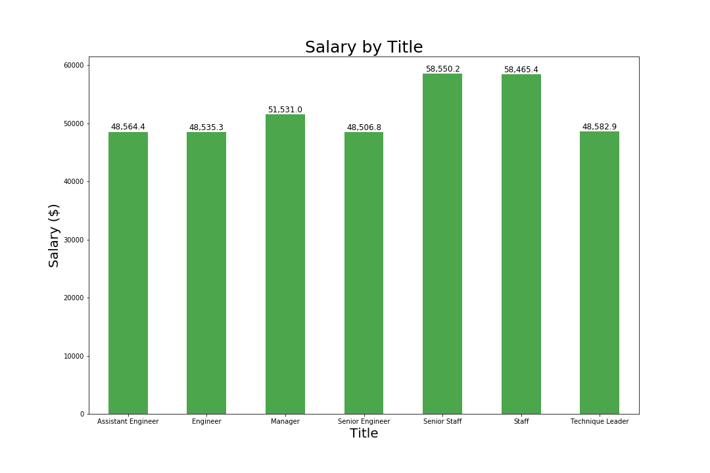
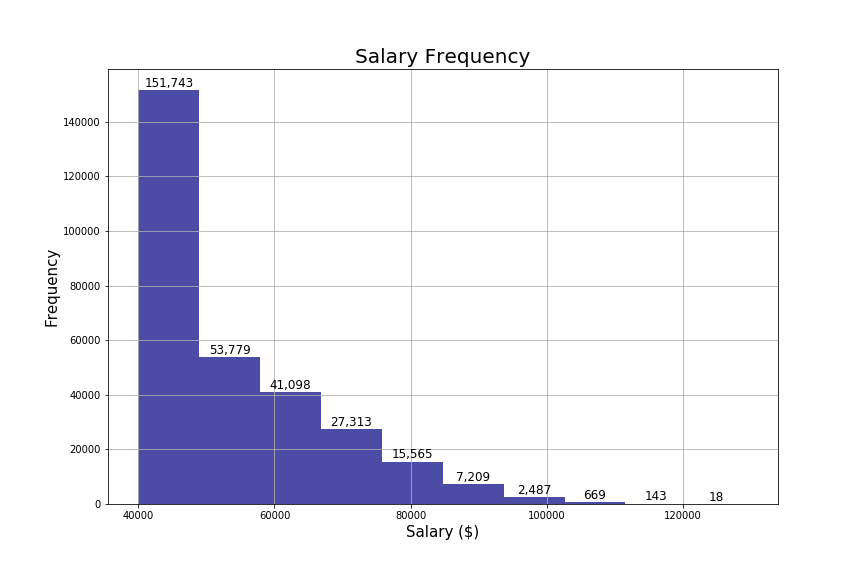

SQL Homework Readme:

In this assignment we are asked to utilize PostgresSQL to do a variety of searches against different tables for a company. The company has table information on departments, employees, employee titles, first name, last name, sex, hire date, and salaries. Below are the following actions that had to be performed to obtain the desired tables:

1. List the following details of each employee: employee number, last name, first name, sex, and salary.

2. List first name, last name, and hire date for employees who were hired in 1986.

3. List the manager of each department with the following information: department number, department name, the manager's employee number, last name, first name.

4. List the department of each employee with the following information: employee number, last name, first name, and department name.

5. List first name, last name, and sex for employees whose first name is "Hercules" and last names begin with "B."

6. List all employees in the Sales department, including their employee number, last name, first name, and department name.

7. List all employees in the Sales and Development departments, including their employee number, last name, first name, and department name.

8. In descending order, list the frequency count of employee last names, i.e., how many employees share each last name.

Bonus:
In this bonus we are asked to create a histogram of the frequency of salaries and a bar graph illustrating the salaries of employees by title. The following results are the following:

Histogram

Bar Graph
